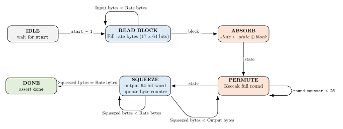

# SHAKE256-VHDL

A VHDL implementation of SHAKE256 based on the Keccak-f[1600] permutation.

The design uses 64-bit input and output streaming interfaces, together with a 1600-bit register to store the internal SHAKE state.

## Repository Structure

```text
rtl/
  keccak_pkg.vhd
  theta.vhd
  rho_pi.vhd
  chi.vhd
  iota.vhd
  keccak_round_constants.vhd
  round.vhd
  controller.vhd

tb/
  tb_controller.vhd

reports/
  synthesis.txt

figures/
  fsm.svg
```

The `rtl/` folder contains the modules implementing the Keccak round operations and the controller logic. The controller handles absorbing input words, applying the SHAKE256 padding, running the Keccak-f[1600] permutation, and outputting the requested number of bytes.

The current implementation is limited to input messages of up to 64 bytes. This is sufficient for the intended use case of expanding seed material in post-quantum cryptography schemes. Future versions should extend the controller to support arbitrary-size input messages.

## Controller

The controller is the top-level module of the design:

```vhdl
entity controller is
    port (
        clk              : in  std_logic;
        rst              : in  std_logic;

        start            : in  std_logic;

        -- 64-bit input stream, little-endian byte order inside each word.
        din              : in  std_logic_vector(63 downto 0);
        din_valid        : in  std_logic;
        din_ready        : out std_logic;

        -- din_bytes is only used on the final word and may be 0..8.
        din_bytes        : in  integer range 0 to 8;
        din_last_block   : in  std_logic;

        -- SHAKE output length in bytes.
        output_len_bytes : in  integer range 0 to 65535;

        -- 64-bit output stream.
        dout             : out std_logic_vector(63 downto 0);
        dout_valid       : out std_logic;
        dout_ready       : in  std_logic;
        dout_bytes       : out integer range 0 to 8;

        done             : out std_logic
    );
end controller;
```

The input interface processes one 64-bit word at a time. SHAKE256 has a rate of 136 bytes, corresponding to 17 64-bit words per rate block. However, in the current implementation, input messages are limited to 64 bytes, so at most 8 input words are provided before padding.

The `din_last_block` signal marks the final input word of the message. On the final word, `din_bytes` indicates how many bytes of `din` are valid. The controller then applies the SHAKE256 padding, absorbs the padded block into the internal state, and starts the Keccak-f[1600] permutation.

The output interface also streams data in 64-bit words. The `dout_bytes` signal indicates how many bytes of the current output word are valid, which is especially useful for the final output word when the requested output length is not a multiple of 8 bytes.

The controller FSM is shown in the following figure:



A testbench is also provided to verify the correctness of the design for different input message sizes and output lengths.

## Synthesis

The design was synthesized with:

```text
Tool       : Vivado 2025.2
Device     : xc7a35tftg256-1
Top module : controller
```

The target device is an Artix-7 FPGA with speed grade `-1`.

| Resource        |  Used | Available | Utilization |
| --------------- | ----: | --------: | ----------: |
| Slice LUTs      | 4,825 |    20,800 |      23.20% |
| Slice Registers | 2,739 |    41,600 |       6.58% |
| Block RAM       |     0 |        50 |       0.00% |
| DSPs            |     0 |        90 |       0.00% |
| BUFG            |     1 |        32 |       3.13% |
| Bonded IOB      |   161 |       170 |      94.71% |

The logic resource usage is acceptable for the target device. The IOB utilization is high because both the input and output interfaces expose 64-bit buses at the top level.

## Performance

The input stage takes one cycle per 64-bit input word. Since the current implementation supports messages of up to 64 bytes, the input stage takes up to 8 cycles for the message words, followed by padding and absorption.

The absorb step consists mainly of XORing the input block into the internal SHAKE state.

The Keccak-f[1600] permutation consists of 24 rounds. In this implementation, one round is executed per clock cycle, so the permutation takes 24 clock cycles.

The output stage streams one 64-bit word per cycle. Therefore, the number of output cycles is approximately:

```text
ceil(output_len_bytes / 8)
```

For output lengths larger than the SHAKE256 rate of 136 bytes, additional Keccak-f[1600] permutations are required after each squeezed rate block.
